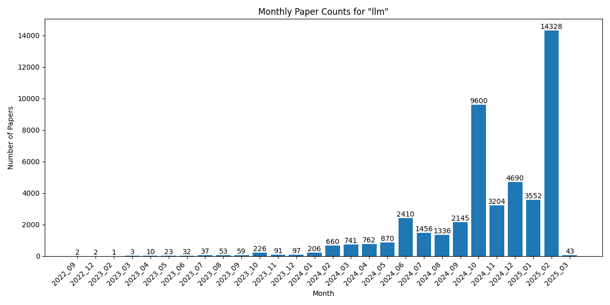

# Daily arXiv Papers
This project automatically tracks and organizes the latest arXiv papers on specific research topics.

Papers are organized by keywords (like 'gaussian splatting', 'embodied ai', 'llm') and grouped by month.

Each monthly directory contains up to 100 papers per file for better readability.

Click 'Watch' in the top right to receive notifications when new papers are added.

Last update: 2025-01-25

## Statistics

| Keyword | Total Papers | Latest Month Papers |
| --- | --- | --- |
| gaussian splatting | 1644 | 2025_01 (67 papers) |
| embodied ai | 280 | 2025_01 (14 papers) |
| llm | 11073 | 2025_01 (1544 papers) |

## Monthly Trends

### gaussian splatting

### embodied ai

### llm

