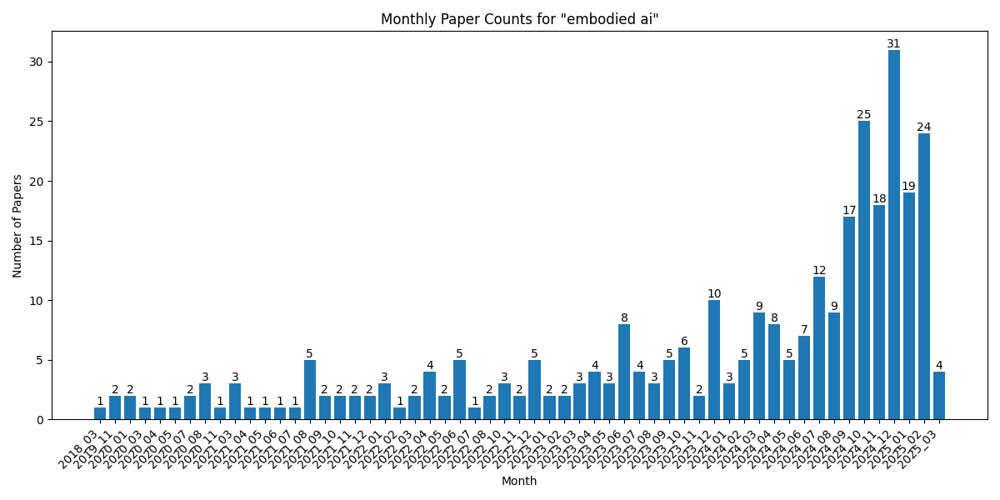

# Statistics for embodied ai

[Home](https://lixin97.github.io/arXivRadar) - [Papers](https://lixin97.github.io/arXivRadar/papers) - [embodied ai](https://lixin97.github.io/arXivRadar/papers/embodied_ai)

## Overall Statistics

- Total number of papers: 100
- Number of months tracked: 5
- Average papers per month: 20.0

## Monthly Trends

## Monthly Breakdown

| Month | Paper Count | Percentage of Total |
| --- | --- | --- |
| [2025_01](./2025_01/papers_1.md) | 16 | 16.0% |
| [2024_12](./2024_12/papers_1.md) | 31 | 31.0% |
| [2024_11](./2024_11/papers_1.md) | 18 | 18.0% |
| [2024_10](./2024_10/papers_1.md) | 25 | 25.0% |
| [2024_09](./2024_09/papers_1.md) | 10 | 10.0% |
