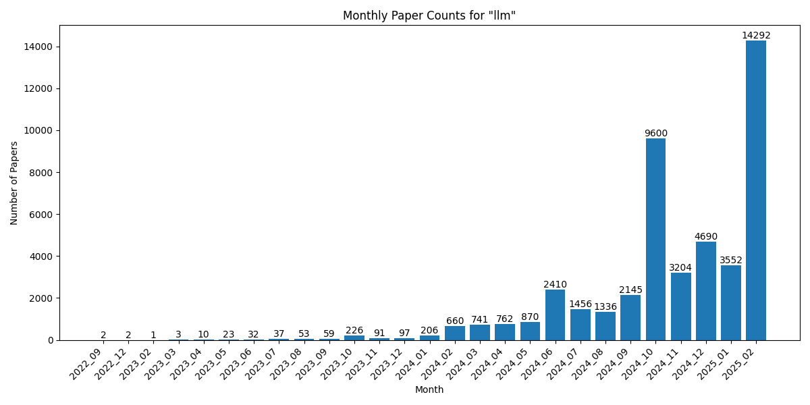

# Statistics for llm

## Overall Statistics

- Total number of papers: 11073
- Number of months tracked: 4
- Average papers per month: 2768.2

## Monthly Trends

## Monthly Breakdown

| Month | Paper Count | Percentage of Total |
| --- | --- | --- |
| 2025_01 | 1544 | 13.9% |
| 2024_12 | 4753 | 42.9% |
| 2024_11 | 3240 | 29.3% |
| 2024_10 | 1536 | 13.9% |
